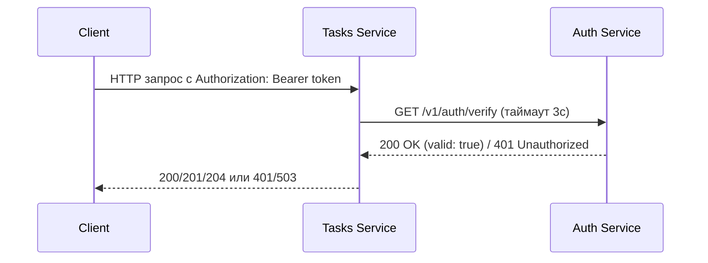
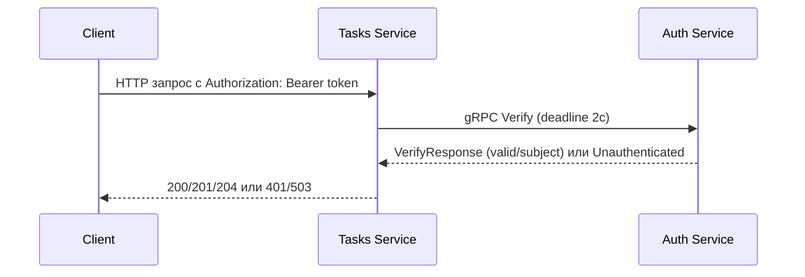

# Практическое задание 1 и 2
## Шишков А.Д. ЭФМО-02-22
## Тема
Разделение монолитного приложения на 2 микросервиса. Взаимодействие через HTTP. 

gRPC: создание простого микросервиса, вызовы методов.
## Цели
Научиться декомпозировать небольшую систему на два сервиса и организовать корректное синхронное взаимодействие по HTTP (с таймаутами, статусами ошибок и прокидыванием request-id). 

Научиться работать с gRPC: описывать контракт в .proto, поднимать gRPC-сервер и вызывать его из другого сервиса (клиента) с дедлайном.


## 1. Описание границ сервисов

Система состоит из двух микросервисов:

**Auth Service** отвечает за аутентификацию: принимает логин/пароль и выдаёт упрощённый токен доступа, а также проверяет валидность токена по запросу. Предоставляет два интерфейса проверки — HTTP (ПЗ1) и gRPC (ПЗ2). Не хранит задачи и не знает о бизнес-логике Tasks.

**Tasks Service** реализует CRUD-операции над задачами (создание, чтение, обновление, удаление). Хранит задачи в памяти (`map[id]Task`). Перед выполнением любой операции обращается к Auth Service для проверки токена. Поддерживает два режима взаимодействия с Auth: через HTTP-клиент и через gRPC-клиент, переключаемых переменной окружения `AUTH_MODE`.

Такое разделение обеспечивает независимое развёртывание, тестирование и масштабирование каждого сервиса.

---

## 2. Структура проекта

```
pz1.2/
├── services/
│   ├── auth/
│   │   ├── cmd/auth/main.go          # Точка входа Auth
│   │   ├── Dockerfile
│   │   └── internal/
│   │       ├── http/handler.go       # HTTP хендлеры
│   │       ├── grpc/server.go        # gRPC сервер
│   │       └── service/auth.go       # Бизнес-логика
│   └── tasks/
│       ├── cmd/tasks/main.go         # Точка входа Tasks
│       ├── Dockerfile
│       └── internal/
│           ├── http/handler.go       # HTTP хендлеры
│           ├── service/task.go       # Бизнес-логика
│           └── client/authclient/    # Клиенты для Auth
│               ├── client.go         # Интерфейс
│               ├── http.go           # HTTP клиент (ПЗ1)
│               └── grpc.go           # gRPC клиент (ПЗ2)
├── shared/
│   ├── middleware/
│   │   ├── requestid.go              # Middleware для X-Request-ID
│   │   └── logging.go                # Middleware для логирования
│   └── httpx/
│       └── client.go                 # HTTP клиент с таймаутом
├── proto/
│   ├── auth.proto                    # Определение gRPC контракта
│   └── auth/                         # Сгенерированный код
├── docs/
│   └── api.md                        # Документация API
├── go.mod
└── README.md
```

---

## 3. Схема взаимодействия

### ПЗ1: HTTP взаимодействие



### ПЗ2: gRPC взаимодействие



---

## 4. Спецификация API

### 4.1. Auth Service (порт 8081)

| Метод | Путь | Описание | Коды ответов |
|-------|------|----------|--------------|
| POST | `/v1/auth/login` | Аутентификация, получение токена | 200, 400, 401 |
| GET | `/v1/auth/verify` | Проверка валидности токена | 200, 401 |

**POST /v1/auth/login**

Запрос:
```json
{
  "username": "student",
  "password": "student"
}
```

Ответ 200:
```json
{
  "access_token": "demo-token",
  "token_type": "Bearer"
}
```

Ошибки:
- 400 — неверный формат запроса
- 401 — неверные учетные данные

**GET /v1/auth/verify**

Заголовки:
```
Authorization: Bearer <token>
X-Request-ID: <uuid> (опционально)
```

Ответ 200:
```json
{
  "valid": true,
  "subject": "student"
}
```

Ответ 401:
```json
{
  "valid": false,
  "error": "unauthorized"
}
```

### 4.2. Tasks Service (порт 8082)

Все запросы требуют заголовок `Authorization: Bearer <token>`.

| Метод | Путь | Описание | Коды ответов |
|-------|------|----------|--------------|
| POST | `/v1/tasks` | Создание задачи | 201, 400, 401, 503 |
| GET | `/v1/tasks` | Список всех задач | 200, 401, 503 |
| GET | `/v1/tasks/{id}` | Получение задачи по ID | 200, 401, 404, 503 |
| PATCH | `/v1/tasks/{id}` | Обновление задачи | 200, 400, 401, 404, 503 |
| DELETE | `/v1/tasks/{id}` | Удаление задачи | 204, 401, 404, 503 |

**POST /v1/tasks**

Запрос:
```json
{
  "title": "Read lecture",
  "description": "Prepare notes",
  "due_date": "2026-01-10"
}
```

Ответ 201:
```json
{
  "id": "t_001",
  "title": "Read lecture",
  "description": "Prepare notes",
  "due_date": "2026-01-10",
  "done": false
}
```

**GET /v1/tasks**

Ответ 200:
```json
[
  {"id": "t_001", "title": "Read lecture", "done": false},
  {"id": "t_002", "title": "Do practice", "done": true}
]
```

**GET /v1/tasks/{id}**

Ответ 200:
```json
{
  "id": "t_001",
  "title": "Read lecture",
  "description": "Prepare notes",
  "done": false
}
```

Ответ 404:
```json
{
  "error": "task not found"
}
```

**PATCH /v1/tasks/{id}**

Запрос:
```json
{
  "title": "Read lecture (updated)",
  "done": true
}
```

Ответ 200 — обновлённая задача.

**DELETE /v1/tasks/{id}**

Ответ 204 — без тела.

### 4.3. gRPC API (ПЗ2)

```protobuf
syntax = "proto3";

package auth;

option go_package = "pz1.2/proto/auth";

service AuthService {
  rpc Verify(VerifyRequest) returns (VerifyResponse);
}

message VerifyRequest {
  string token = 1;
}

message VerifyResponse {
  bool valid = 1;
  string subject = 2;
  string error = 3;
}
```

Команды генерации кода:

```bash
go install google.golang.org/protobuf/cmd/protoc-gen-go@latest
go install google.golang.org/grpc/cmd/protoc-gen-go-grpc@latest

protoc --go_out=. --go_opt=paths=source_relative \
       --go-grpc_out=. --go-grpc_opt=paths=source_relative \
       proto/auth.proto
```

Результат: `proto/auth/auth.pb.go` и `proto/auth/auth_grpc.pb.go`.

---

## 5. Маппинг ошибок gRPC → HTTP (ПЗ2)

| Ситуация | gRPC-код | HTTP-статус | Описание |
|----------|----------|-------------|----------|
| Невалидный токен | `Unauthenticated` | 401 Unauthorized | Auth вернул, что токен невалиден |
| Внутренняя ошибка Auth | `Internal` | 503 Service Unavailable | Ошибка на стороне Auth |
| Auth недоступен | `Unavailable` | 503 Service Unavailable | Сервис не отвечает |
| Превышен deadline | `DeadlineExceeded` | 503 Service Unavailable | Таймаут gRPC-вызова (2 секунды) |

Реализация в `services/tasks/internal/client/authclient/grpc.go`:
- `codes.Unauthenticated` → клиенту `401` с `{"error": "invalid token"}`
- Любая другая ошибка → клиенту `503` с `{"error": "auth service unavailable"}`

---

## 6. Скриншоты из Postman

### 6.1. Login — получение токена (200)

 


### 6.2. Создание задачи (201)

 


### 6.3. Получение списка задач (200)

 


### 6.4. Запрос без токена (401)


### 6.5. Подтверждение прокидывания X-Request-ID

 


---

## 7. Примеры логов

### 7.1. Успешная проверка токена через gRPC

**Логи Auth Service:**

```
2026/02/25 20:32:14 Auth HTTP server starting on :8081
2026/02/25 20:32:14 Auth gRPC server starting on :50051
2026/02/25 20:32:42 [gRPC] Verify request for token: demo-token...
2026/02/25 20:32:42 [gRPC] Token verified for subject: student
```

**Логи Tasks Service:**

```
2026/02/25 20:32:24 Using gRPC auth client, connecting to localhost:50051
2026/02/25 20:32:24 Tasks HTTP server starting on :8082
2026/02/25 20:32:42 [grpc-req-001] Calling Auth gRPC verify
2026/02/25 20:32:42 [grpc-req-001] Auth gRPC verify: success, subject=student
2026/02/25 20:32:42 [grpc-req-001] Token verified for subject: student
2026/02/25 20:32:42 [grpc-req-001] Creating new task
2026/02/25 20:32:42 [grpc-req-001] Task created: t_de636044
2026/02/25 20:32:42 [grpc-req-001] POST /v1/tasks 201 1.5484ms
```

Видно, что:
- Tasks передаёт `X-Request-ID` (`grpc-req-001`) во все лог-записи
- gRPC verify проходит успешно, subject=student
- Задача создана, ответ 201

### 7.2. Невалидный токен через gRPC (401)

**Логи Auth Service:**

```
2026/02/25 20:32:42 [gRPC] Verify request for token: invalid-to...
2026/02/25 20:32:42 [gRPC] Token verification failed: invalid token
```

**Логи Tasks Service:**

```
2026/02/25 20:32:42 [grpc-req-003] Calling Auth gRPC verify
2026/02/25 20:32:42 [grpc-req-003] Auth gRPC verify: unauthorized
2026/02/25 20:32:42 [grpc-req-003] Invalid token
2026/02/25 20:32:42 [grpc-req-003] GET /v1/tasks 401 0s
```

Auth возвращает gRPC-код `Unauthenticated`, Tasks транслирует его в HTTP 401.

### 7.3. Auth недоступен (503)

**Логи Tasks Service (Auth выключен):**

```
2026/02/25 20:36:47 Using gRPC auth client, connecting to localhost:50051
2026/02/25 20:36:47 Tasks HTTP server starting on :8082
2026/02/25 20:37:04 [grpc-req-fail-001] Calling Auth gRPC verify
2026/02/25 20:37:04 [grpc-req-fail-001] Auth gRPC verify failed: rpc error: code = Unavailable
    desc = connection error: desc = "transport: Error while dialing: dial tcp [::1]:50051:
    connectex: No connection could be made because the target machine actively refused it."
2026/02/25 20:37:04 [grpc-req-fail-001] Auth service unavailable: auth service error: ...
2026/02/25 20:37:04 [grpc-req-fail-001] GET /v1/tasks 503 2.6212ms
```

**Ответ клиенту:**

```
HTTP/1.1 503 Service Unavailable
{"error":"auth service unavailable"}
```

Auth недоступен → gRPC возвращает `Unavailable` → Tasks возвращает HTTP 503. Политика «fail closed»: при невозможности проверить токен доступ запрещён.

---

## 8. Запуск

### Требования

- Go 1.22+
- Git
- curl (для тестирования)

### Установка

```bash
git clone https://github.com/Alex171228/pz1.2.git
cd pz1.2
go mod download
```

### ПЗ1: HTTP взаимодействие

**Терминал 1 — Auth Service:**

```bash
export AUTH_PORT=8081
go run ./services/auth/cmd/auth
```

**Терминал 2 — Tasks Service (HTTP режим):**

```bash
export TASKS_PORT=8082
export AUTH_BASE_URL=http://localhost:8081
export AUTH_MODE=http
go run ./services/tasks/cmd/tasks
```

### ПЗ2: gRPC взаимодействие

**Терминал 1 — Auth Service:**

```bash
export AUTH_PORT=8081
export AUTH_GRPC_PORT=50051
go run ./services/auth/cmd/auth
```

**Терминал 2 — Tasks Service (gRPC режим):**

```bash
export TASKS_PORT=8082
export AUTH_GRPC_ADDR=localhost:50051
export AUTH_MODE=grpc
go run ./services/tasks/cmd/tasks
```

### Переменные окружения

| Переменная | Сервис | Описание | По умолчанию |
|------------|--------|----------|--------------|
| AUTH_PORT | Auth | Порт HTTP сервера | 8081 |
| AUTH_GRPC_PORT | Auth | Порт gRPC сервера | 50051 |
| TASKS_PORT | Tasks | Порт HTTP сервера | 8082 |
| AUTH_MODE | Tasks | Режим: `http` или `grpc` | http |
| AUTH_BASE_URL | Tasks | URL Auth (для HTTP) | http://localhost:8081 |
| AUTH_GRPC_ADDR | Tasks | Адрес Auth (для gRPC) | localhost:50051 |

---

## 9. Тестирование (curl)

### Получение токена

```bash
curl -s -X POST http://localhost:8081/v1/auth/login \
  -H "Content-Type: application/json" \
  -H "X-Request-ID: req-001" \
  -d '{"username":"student","password":"student"}'
```

### Проверка токена напрямую

```bash
curl -i http://localhost:8081/v1/auth/verify \
  -H "Authorization: Bearer demo-token" \
  -H "X-Request-ID: req-002"
```

### Создание задачи

```bash
curl -i -X POST http://localhost:8082/v1/tasks \
  -H "Content-Type: application/json" \
  -H "Authorization: Bearer demo-token" \
  -H "X-Request-ID: req-003" \
  -d '{"title":"Do PZ17","description":"split services","due_date":"2026-01-10"}'
```

### Получение задач

```bash
curl -i http://localhost:8082/v1/tasks \
  -H "Authorization: Bearer demo-token" \
  -H "X-Request-ID: req-004"
```

### Запрос без токена (должен вернуть 401)

```bash
curl -i http://localhost:8082/v1/tasks \
  -H "X-Request-ID: req-005"
```

---

## 10. Контрольные вопросы

### ПЗ1

**1. Почему межсервисный вызов должен иметь таймаут?**

Таймаут предотвращает каскадные отказы: если Auth «зависнет», Tasks не будет бесконечно ждать ответа, а вернёт клиенту ошибку через 2–3 секунды. Без таймаута накапливаются заблокированные горутины, что приводит к исчерпанию ресурсов и отказу всего сервиса.

**2. Как request-id помогает при диагностике ошибок?**

X-Request-ID — уникальный идентификатор, который прокидывается через все сервисы в цепочке вызовов. Позволяет связать логи Auth и Tasks для одного пользовательского запроса и быстро найти, на каком этапе произошла ошибка.

**3. Какой статус нужно вернуть клиенту при невалидном токене?**

401 Unauthorized — стандартный HTTP-статус, означающий, что клиент не прошёл аутентификацию.

**4. Как описать «точку отказа» между сервисами?**

Если Auth недоступен, Tasks возвращает 503 Service Unavailable. Это политика «fail closed»: при невозможности проверить токен доступ запрещён.

### ПЗ2

**1. Что такое .proto и почему он считается контрактом?**

Файл `.proto` — формальное описание API (сервисы, методы, структуры сообщений) на языке Protocol Buffers. Он является контрактом, потому что по нему генерируется код для клиента и сервера: обе стороны обязаны следовать описанным типам и сигнатурам.

**2. Что такое deadline в gRPC и чем он полезен?**

Deadline — абсолютное время, до которого вызов должен завершиться. В отличие от таймаута, deadline автоматически пробрасывается через цепочку вызовов. Если время истекло, gRPC отменяет запрос и возвращает `DeadlineExceeded`.

**3. Почему «exactly-once» не может быть так прост в RPC?**

Сетевые сбои делают невозможным гарантировать однократное выполнение «из коробки»: запрос мог дойти до сервера, но ответ потерялся, и клиент повторит вызов. Для exactly-once нужна идемпотентность операций и дедупликация на стороне сервера.

**4. Как обеспечивать совместимость при расширении .proto?**

- Добавлять новые поля с новыми номерами (не переиспользовать старые)
- Не удалять и не переименовывать существующие поля
- Использовать `reserved` для защиты удалённых номеров полей от повторного использования
