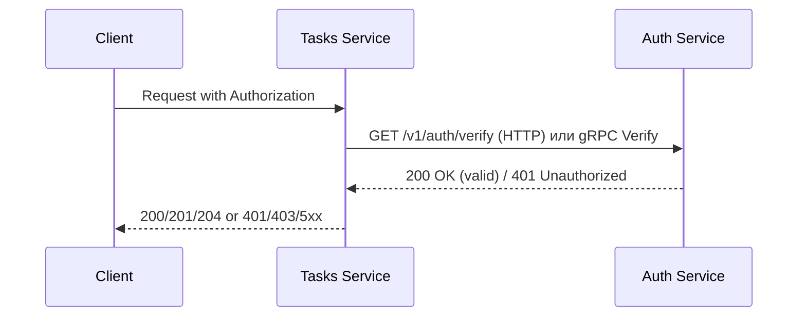

# API Documentation

## Архитектура системы

Система состоит из двух микросервисов:

1. **Auth Service** - сервис авторизации
   - Выдача токенов (login)
   - Проверка токенов (verify) через HTTP и gRPC

2. **Tasks Service** - сервис управления задачами
   - CRUD операции над задачами
   - Проверка токенов через Auth Service

## Схема взаимодействия (Mermaid)



## Auth Service API

### POST /v1/auth/login

Аутентификация пользователя и получение токена.

**Request:**
```json
{
  "username": "student",
  "password": "student"
}
```

**Response 200:**
```json
{
  "access_token": "demo-token",
  "token_type": "Bearer"
}
```

**Ошибки:**
- 400 - Неверный формат запроса
- 401 - Неверные учетные данные

### GET /v1/auth/verify

Проверка валидности токена.

**Headers:**
```
Authorization: Bearer <token>
X-Request-ID: <uuid> (опционально)
```

**Response 200:**
```json
{
  "valid": true,
  "subject": "student"
}
```

**Response 401:**
```json
{
  "valid": false,
  "error": "unauthorized"
}
```

## Tasks Service API

Все endpoints требуют заголовок Authorization.

### POST /v1/tasks

Создание новой задачи.

**Headers:**
```
Authorization: Bearer <token>
X-Request-ID: <uuid> (опционально)
Content-Type: application/json
```

**Request:**
```json
{
  "title": "Read lecture",
  "description": "Prepare notes",
  "due_date": "2026-01-10"
}
```

**Response 201:**
```json
{
  "id": "t_001",
  "title": "Read lecture",
  "description": "Prepare notes",
  "due_date": "2026-01-10",
  "done": false
}
```

### GET /v1/tasks

Получение списка всех задач.

**Response 200:**
```json
[
  {
    "id": "t_001",
    "title": "Read lecture",
    "done": false
  },
  {
    "id": "t_002",
    "title": "Do practice",
    "done": true
  }
]
```

### GET /v1/tasks/{id}

Получение задачи по ID.

**Response 200:**
```json
{
  "id": "t_001",
  "title": "Read lecture",
  "description": "Prepare notes",
  "done": false
}
```

**Response 404:**
```json
{
  "error": "task not found"
}
```

### PATCH /v1/tasks/{id}

Обновление задачи.

**Request:**
```json
{
  "title": "Read lecture (updated)",
  "done": true
}
```

**Response 200:**
```json
{
  "id": "t_001",
  "title": "Read lecture (updated)",
  "description": "Prepare notes",
  "done": true
}
```

### DELETE /v1/tasks/{id}

Удаление задачи.

**Response 204** - Нет тела

## Переменные окружения

### Auth Service

| Переменная | Описание | Значение по умолчанию |
|------------|----------|----------------------|
| AUTH_PORT | Порт HTTP сервера | 8081 |
| AUTH_GRPC_PORT | Порт gRPC сервера | 50051 |

### Tasks Service

| Переменная | Описание | Значение по умолчанию |
|------------|----------|----------------------|
| TASKS_PORT | Порт HTTP сервера | 8082 |
| AUTH_MODE | Режим взаимодействия с Auth (http/grpc) | http |
| AUTH_BASE_URL | URL Auth сервиса (для HTTP) | http://localhost:8081 |
| AUTH_GRPC_ADDR | Адрес Auth сервиса (для gRPC) | localhost:50051 |

## gRPC API (ПЗ2)

### Сервис AuthService

**Метод Verify:**

```protobuf
service AuthService {
  rpc Verify(VerifyRequest) returns (VerifyResponse);
}

message VerifyRequest {
  string token = 1;
}

message VerifyResponse {
  bool valid = 1;
  string subject = 2;
  string error = 3;
}
```

## Примеры запросов curl

### Получение токена
```bash
curl -s -X POST http://localhost:8081/v1/auth/login \
  -H "Content-Type: application/json" \
  -H "X-Request-ID: req-001" \
  -d '{"username":"student","password":"student"}'
```

### Проверка токена напрямую
```bash
curl -i http://localhost:8081/v1/auth/verify \
  -H "Authorization: Bearer demo-token" \
  -H "X-Request-ID: req-002"
```

### Создание задачи через Tasks
```bash
curl -i -X POST http://localhost:8082/v1/tasks \
  -H "Content-Type: application/json" \
  -H "Authorization: Bearer demo-token" \
  -H "X-Request-ID: req-003" \
  -d '{"title":"Do PZ17","description":"split services","due_date":"2026-01-10"}'
```

### Получение всех задач
```bash
curl -i http://localhost:8082/v1/tasks \
  -H "Authorization: Bearer demo-token" \
  -H "X-Request-ID: req-004"
```

### Попытка без токена (должен вернуть 401)
```bash
curl -i http://localhost:8082/v1/tasks \
  -H "X-Request-ID: req-005"
```
